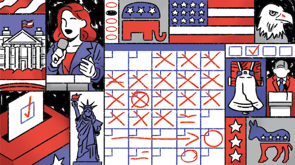

# Applied Data Science @ Columbia
## Spring 2021
## Project 1: A "data story" on how Americans vote



### [Project Description](doc/)
This is the first and only *individual* (as opposed to *team*) this semester. 

Term: Spring 2021

+ Projec title: The impact of media on US election
+ This project is conducted by Chuanchuan Liu

+ Project summary: 
This is a data story about the impact of media on US election. To be more specific, it is going to figure out if there exists a correlation between media and voting behaviors in 2012 US election. 

+ 3 Scientific questions will be analyzed: 
Question1: Does the voting behaviors and the specific TV program people watching have a correlation?
Question2: Does the voting behavior and the weekly frequency people accessing to news have a correlation? 
Question3: Does the voting behavior and the attention level people paying to news have a correlation? 

Following [suggestions](http://nicercode.github.io/blog/2013-04-05-projects/) by [RICH FITZJOHN](http://nicercode.github.io/about/#Team) (@richfitz). This folder is orgarnized as follows.

```
proj/
├── lib/
├── data/
├── doc/
├── figs/
└── output/
```

Please see each subfolder for a README file.
