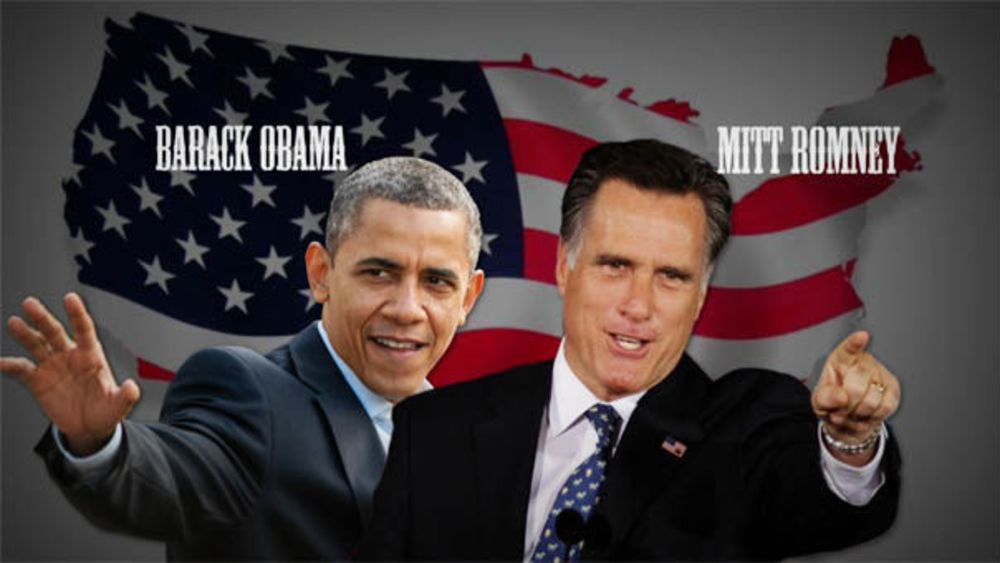

# Introduction

It is undoubted that the media have played an important role in politics, due to the freedom of the press in the US. Also, voters need information to make educated decisions. 

However, whether the media can really influence the result of US election deserves a think-through. 

This is a data story about the impact of media on US election. 
To be more specific, it is going to figure out if there exists a correlation between media and voting behaviors in 2012 US election.

This report is based on the exploratory data analysis (EDA) of survey responses from the 2016 election from ANES (see https://electionstudies.org/).

### packages

```{r}
library(tidyverse)
library(haven)
library(devtools)
library(RColorBrewer)
library(DT)
library(ggplot2)
library(corrplot)
```

### import data

```{r}
data <- read_sav("anes_timeseries_2016.sav")
```

# Background

### Recall of 2012 Presidential voting result



```{r}
voting <- table(data$V161006)
names(voting)[] <- c('Refused','Dont Know', 'Inap', 'Barack Obama', 'Mitt Romney', 'Other SPECIFY', 'Did not Vote')
voting
```

```{r}
barplot(voting, main = '2012 Voting Result', cex.names=0.3)
```

From the bar plot, we can see that Barack Obama received the most votes of 1728 and Mitt Romney received the next of 1268. 
Thus, I am going to focus on the voting behaviors towards Obama - democratic candidate and Romney - republican candidate. 

# Scientific Questions 
The impact of media will be analyzed from 3 perspectives - the specific TV program, the weekly frequency, and the attention level. 

## Question1: Does the voting behaviors and the specific TV program people watching have a correlation?

Let's first take a look at the media sources from which people have heard anything about the presidential campaign. 


```{r}
TVNews=sum(data$V161363a==1)
Newspapers=sum(data$V161363b==1)
TVTalkShows=sum(data$V161363c==1)
Internet=sum(data$V161363d==1)
RadioNews=sum(data$V161363e==1)
NotHeard=sum(data$V161363f==1)
media <- c(TVNews,Newspapers,TVTalkShows,Internet,RadioNews,NotHeard)
names(media) <-c('TVNews','Newspapers','TVTalkShows','Internet','RadioNews','NotHeard')
media
```

```{r}
barplot(media, main = 'media sources', cex.names=0.3)
```

From the bar plot, we can see that TV news programs is the most popular social media for people to learn about the presidential campaign.  

Thus, I am going to find out if the specific Television news program would influence voting behaviors. 

Let's take the TV program 20/20 (program1) and TV program Primer Impacto (program2) as an example. 


```{r}
program1 <- table(data$V161006, data$V161364)
colnames(program1) <- c('Refused','Interview breakoff','INAP','Selected','Not Selected')
rownames(program1) <- c('Refused','Dont Know', 'Inap', 'Barack Obama', 'Mitt Romney', 'Other SPECIFY', 'Did not Vote')
program1
```


```{r}
program2 <- table(data$V161006, data$V161426)
colnames(program2) <- c('Refused','Interview breakoff','INAP','Selected','Not Selected')
rownames(program2) <- c('Refused','Dont Know', 'Inap', 'Barack Obama', 'Mitt Romney', 'Other SPECIFY', 'Did not Vote')
program2
```

By comparing the voting proportion, people who watch TV program Primer Impacto are more likely to vote for Barack Obama than people who watch TV program 20/20. 

Repeating the analysis for all 64 TV programs, we can find out that the voting proportion differs among different TV programs.  
Therefore, the specific TV program people watching is truly correlated with the voting behaviors. 

## Question2: Does the voting behavior and the weekly frequency people accessing to news have a correlation? 

It is given that the number of days in a week people watch/listen/read news on any media. 

```{r}
frequency <- table(data$V161008)
names(frequency)[] <- c('Refused', 'Dont Know', 'None', 'One', 'Two', 'Three', 'Four', 'Five', 'Six', 'Seven') 
frequency
```

```{r}
barplot(frequency, main = 'Number of Days News is Watched/Read/Listened Each Week' , cex.names = 0.3)
```

Interestingly, the bar plot indicates that the majority of participants observe the news 7 days a week, with the next highest number at 5 days. 
Let's jointly take a look at the voting behaviors and the weekly frequency. 

```{r}
joint1<-table(data$V161006,data$V161008)
colnames(joint1) <- c('Refused', 'Dont Know', 'None', 'One', 'Two', 'Three', 'Four', 'Five', 'Six', 'Seven')
rownames(joint1) <- c('Refused','Dont Know', 'Inap', 'Barack Obama', 'Mitt Romney', 'Other SPECIFY', 'Did not Vote')
joint1
```

```{r}
mosaicplot(joint1, xlab = 'Voting Behavior', ylab = 'Weekly Frequency', main = 'Voter Behavior and Weekly Frequency', color = TRUE)
```

By the mosaic plot, we **CANNOT** see that as the weekly frequency increases or decreases, people are more or less likely to vote for Barack Obama or Mitt Romney. 

Chi-square test can also be conducted to determine if there is any statistically significant interaction between these two categorical variables. 

```{r}
chisq1 <- chisq.test(joint1)
chisq1
```

```{r}
contrib <- 100*chisq1$residuals^2/chisq1$statistic
corrplot(contrib, is.corr = FALSE)
```

By the balloon plot of contribution to the total chi-square score, we **CANNOT** see the strong association between the number of days and voting behaviors towards Barack Obama or Mitt Romney, due to the nearly same size of the circle. 

Thus, we can conclude **NO** clear interaction between voting behaviors and weekly frequency people accessing to news. 

## Question3: Does the voting behavior and the attention level people paying to news have a correlation? 

It is given that the level of attention people engage in news on any media. 

```{r}
attention <- table(data$V161009)
names(attention)[] <- c('Refused', 'Inap', 'A Great Deal', 'A Lot', 'Moderate', 'A Little', 'None at All')
attention
```

```{r}
barplot(attention, main = 'Level of Attention to News', cex.names= 0.3)
```
Unsurprisingly, most participants pay a a lot or a moderate amount of attention to the news. 

Similarly, let's jointly take a look at the voting behaviors and the level of attention.

```{r}
joint2 <- table(data$V161006,data$V161009)
colnames(joint2) <- c('Refused', 'Inap', 'A Great Deal', 'A Lot', 'Moderate', 'A Little', 'None at All')
rownames(joint2) <- c('Refused','Dont Know', 'Inap', 'Barack Obama', 'Mitt Romney', 'Other SPECIFY', 'Did not Vote')
joint2
```

```{r}
mosaicplot(joint2, xlab = 'Voting Behavior', ylab = 'Attention Level', main = 'Voter Behavior and Attention Level', color = TRUE)
```

By the mosaic plot, we **CANNOT** see that as the attention level increases or decreases, people are more or less likely to vote for Barack Obama or Mitt Romney. 

Similarly, chi-square test can be conducted here. 

```{r}
chisq2 <- chisq.test(joint2)
chisq2
```

```{r}
contrib <- 100*chisq2$residuals^2/chisq2$statistic
corrplot(contrib, is.corr = FALSE)
```

By the balloon plot of contribution to the total chi-square score, we **CANNOT** see the strong association between the level of attention and voting behaviors towards Barack Obama or Mitt Romney, due to the nearly same size of the circle. 

Thus, we can also conclude **NO** clear interaction between voting behaviors and attention level people paying to news.

# Conclusion and expansion

It is shown above that the voting behaviors towards different political parties is correlated with the specific TV programs people watching, but uncorrelated with the weekly frequency people accessing to news or the attention level people paying to news. 

It is true that the voting behaviors is mainly based on people's subjective choice, but this report shows that the media would exert some influence on it to some extent. 
As a result, we cannot negate the impact of media on US election. 


